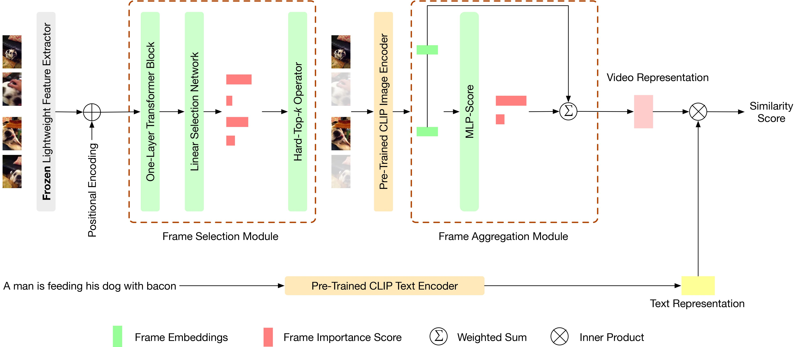

# AdaCLIP: Towards Pragmatic Multimodal Video Retrieval

This repo is the implementation for the paper "AdaCLIP: Towards Pragmatic Multimodal Video Retrieval".



Incorporating large image-text foundation models such as CLIP has
substantially improved the performance of the multimodal video
retrieval task. However, how to practically sample the frames from
a video and aggregate the frame features into a video representation
is still an open research question. In particular, real-world
deployment scenarios, such as embodiment within consumer electronics
or cloud-based inference pipelines, require two key facets of
retrieval (representation building and search) to be computationally
light and fast. In this paper, we propose AdaCLIP, a computationand
latency-aware system for pragmatic multimodal video retrieval.
AdaCLIP consists of a *learning-based frame selection module* to select
informative frames and a *query-independent frame aggregation
module* to obtain strong video representations from the frame features.
Specifically, in the frame selection module, we introduce a
differentiable *Hard-Top-k* algorithm to sample a subset of the frames
while optimizing the performance of the video retrieval task in an
end-to-end manner. Moreover, to be latency-aware, we also propose
a query-independent lightweight approach, *MLP-Score*, to aggregate
the frame features into the video representation, which offers
up to 142x speedup on GPU and 822x speedup on CPU in similarity
search time compared to query-dependent matching methods.
Experimental results on several popular video retrieval datasets
confirm the effectiveness of AdaCLIP.

## Maintainers
- Angela Ye (angela.ye@samsung.com)
- Zhiming Hu (zhiming.hu@samsung.com)

## Prerequisites

- Linux (Ubuntu 16.04 or later is recommended)
- Python 3.7
- Packages:
    - ffmpeg (`$sudo apt-get install ffmpeg`)
- Datasets: [ActivityNet Dense Captions](https://cs.stanford.edu/people/ranjaykrishna/densevid/), [MSRVTT](http://ms-multimedia-challenge.com/2017/dataset), [DiDeMo](https://github.com/LisaAnne/LocalizingMoments)

## How to Install

Create a conda environment and install the appropriate packages:
```
$ conda create -n adaclip python=3.7 -y
$ conda activate adaclip
$ conda install -y pytorch==1.12.1 torchvision==0.13.1 torchaudio==0.12.1 cudatoolkit=11.6 -c pytorch -c conda-forge
$ pip install -r requirements.txt
```

Update `cudatoolkit=11.6` with the appropriate CUDA version on your machine.

## Datasets

### MSRVTT

The videos are shared by [Frozen in Time](https://github.com/m-bain/frozen-in-time#-finetuning-benchmarks-msr-vtt):
```
wget https://www.robots.ox.ac.uk/~maxbain/frozen-in-time/data/MSRVTT.zip
```

### DiDeMo

The videos can be downloaded from [LisaAnne/LocalizingMoments](https://github.com/LisaAnne/LocalizingMoments).

### ActivityNet

Download the videos from the [official website](http://activity-net.org/download.html). The authors have made the videos available on Google and Baidu drives.


## Preprocessing

### Frame Extraction

Run `utils/frame_extraction.py` after having downloaded the dataset videos and annotations from the website. Make sure that all the videos are in the same directory (no sub-directories allowed).

```
python utils/frame_extraction.py /path/to/videos /path/to/frames --parallel
```

Subsequently, update the `frames_dir` parameter in the config files `configs/[dataset].json`.

### Annotation Preprocessing

If the videos downloaded differ from the set used in the paper, run `annot_preprocess/{dataset}_preprocess.py` to generate train/test splits used by the dataloader. Splits used in the paper can be found in `annots/`.

To obtain the annotation files used to generate the splits, please download them from the following links:
- MSRVTT annotations are from [CLIP4Clip](https://github.com/ArrowLuo/CLIP4Clip): 
```
wget https://github.com/ArrowLuo/CLIP4Clip/releases/download/v0.0/msrvtt_data.zip
```
- ActivityNet annotations are from the [project page](https://cs.stanford.edu/people/ranjaykrishna/densevid/) of ActivityNet Captions:
```
wget https://cs.stanford.edu/people/ranjaykrishna/densevid/captions.zip
```
- DiDeMo annotations have two components: annotations from the [original author](https://github.com/LisaAnne/LocalizingMoments/tree/master/data) and the split used by [Collaborative Experts](https://github.com/albanie/collaborative-experts/tree/master/misc/datasets/didemo).

## Training

Train AdaCLIP on MSRVTT
```shell
python -m torch.distributed.launch --nproc_per_node=3 train.py --config configs/msrvtt-jsfusion.json --frames_dir /path/to/msrvtt/frames --top_k 12 --freeze_cnn --frame_agg mlp
```

Train AdaCLIP on DiDeMo
```shell
python -m torch.distributed.launch --nproc_per_node=3 train.py --config configs/didemo.json --frames_dir /path/to/didemo/frames --top_k 16 --num_epochs 5 --freeze_cnn --frame_agg mlp
```

Train AdaCLIP on ActivityNet
```shell
python -m torch.distributed.launch --nproc_per_node=3 train.py --config configs/activitynet.json --frames_dir /path/to/activitynet/frames --top_k 32 --freeze_cnn --frame_agg mlp
```

Train uniform sampling & mean aggregation baseline on MSRVTT
```shell
python -m torch.distributed.launch --nproc_per_node=3 train.py --config configs/msrvtt-jsfusion.json --frames_dir /path/to/msrvtt/frames --no_policy
```

You may need to update the batch size in the config files and/or the number of GPUs used by changing the `--nproc_per_node=NUM_GPU` parameter.

## Inference

Inference on MSRVTT
```shell
python -m torch.distributed.launch --nproc_per_node=3 train.py --config configs/msrvtt-jsfusion.json --frames_dir /path/to/msrvtt/frames --top_k 12 --frame_agg mlp --do_inference --resume /path/to/msrvtt/checkpoint
```

## Citation
If you use this code, please cite our paper:
```
@inproceedings{AdaCLIP,
    title={AdaCLIP: Towards Pragmatic Multimodal Video Retrieval},
    author={Hu, Zhiming and Ye, Angela N and Khorasgani, Salar H and Mohomed, Iqbal},
    booktitle={Proc. of the 31st ACM International Conference on Multimedia},
    year={2023}
}
```
